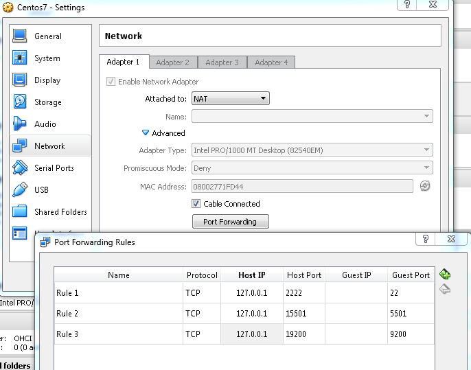

# Prepare Virtual Machine
* Install Virtual Box for windows: available from https://www.virtualbox.org/wiki/Downloads
* Install Centos 7: https://github.com/fjiang212/my-notes/blob/master/vitualization/notes.md
* Set up Network NAT port forward

* Set up yum proxy if needed (/etc/yum.conf)
```  
proxy=http://x.x.x.x:xxxx
proxy_username=xxxx
proxy_password=xxxxx
```
* Install tools
```
yum install dos2unix -y
yum install net-tools -y 
yum install lsof -y
yum install nmap -y
yum install git -y
 ```
* Stop and disable firewall on CentOS 7
```
systemctl disable firewalld
systemctl stop firewalld
```
* Sync guess host time
```
hwclock --systohc
```
http://bytefreaks.net/gnulinux/how-to-startstop-or-enabledisable-firewalld-on-centos-7
# Download and Install Elastic Stack

## Install Elastic Stack and X-Pack
```
rpm -i jdk-8u152-linux-x64.rpm

rpm -i elasticsearch-5.6.3.rpm
systemctl daemon-reload
systemctl enable elasticsearch.service
/usr/share/elasticsearch/bin/elasticsearch-plugin install file:/root/x-pack-5.6.3.zip
 
rpm -i logstash-5.6.3.rpm

rpm -i kibana-5.6.3-x86_64.rpm
systemctl daemon-reload
systemctl enable kibana.service
/usr/share/kibana/bin/kibana-plugin install file:/root/x-pack-5.6.3.zip

rpm -i filebeat-5.6.3-x86_64.rpm
```

## Config Elastic Stack
* Edit /etc/elasticsearch/elasticsearch.yml
```
network.host: 0.0.0.0
```
* Edit /etc/kibana/kibana.yml
```
server.host: 0.0.0.0
```

## Start Elastic Stack
```
service elasticsearch start
service lostash start
service kibana start
service filebeat start
```
